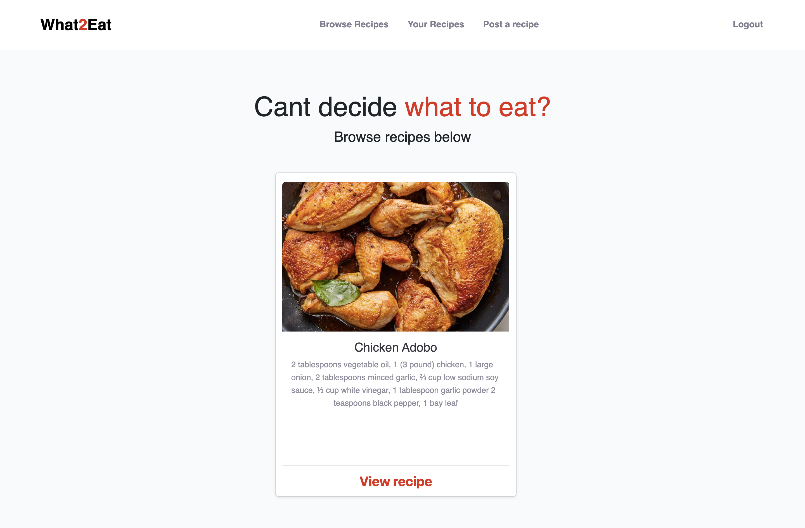
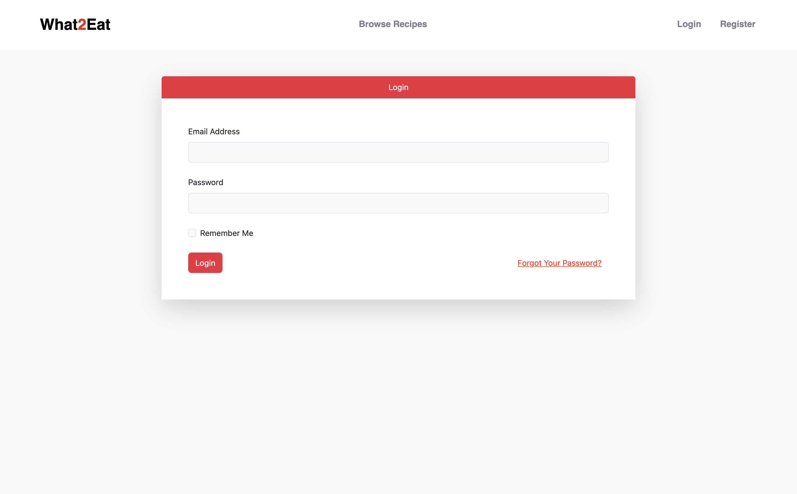
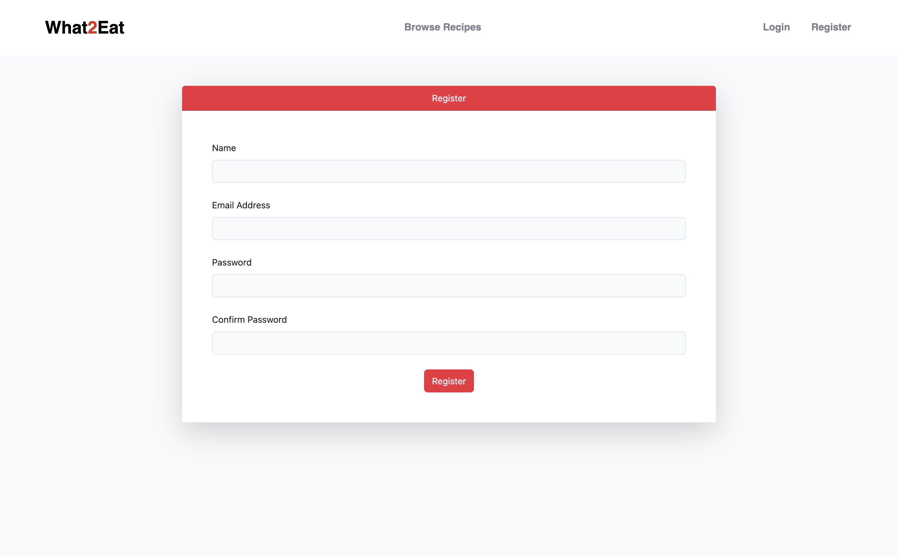
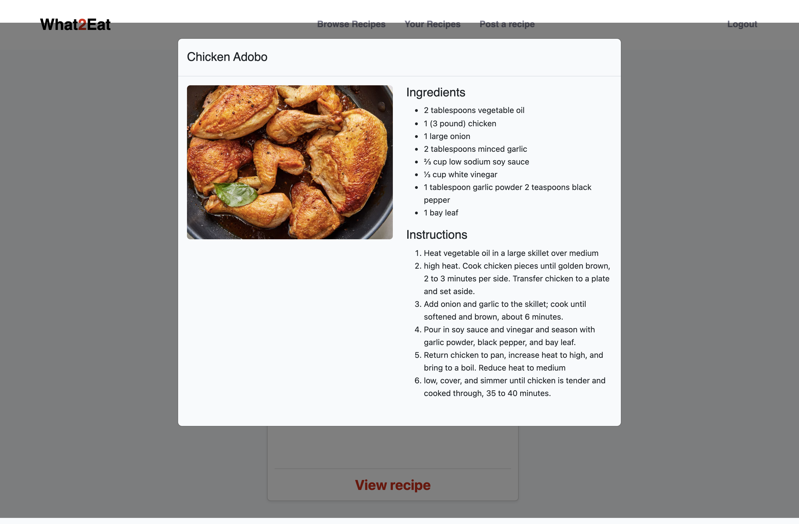
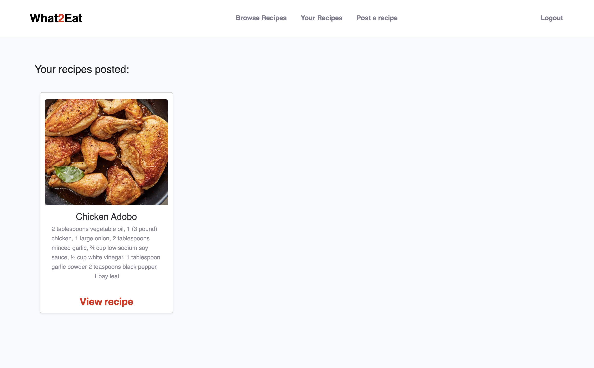
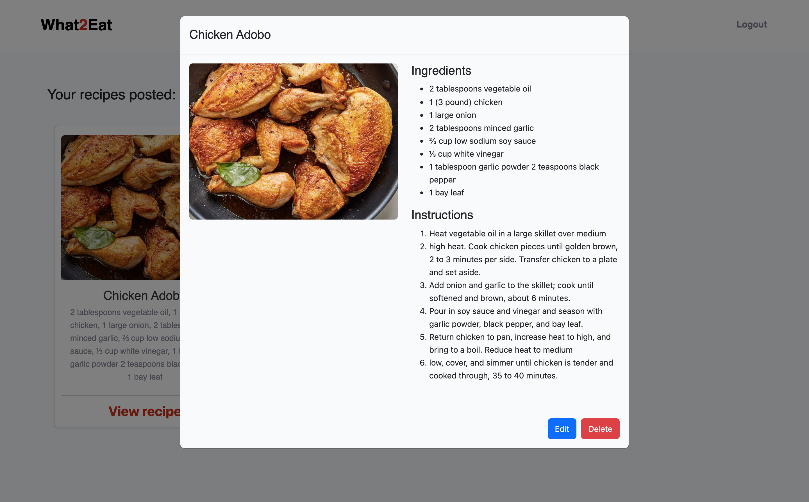
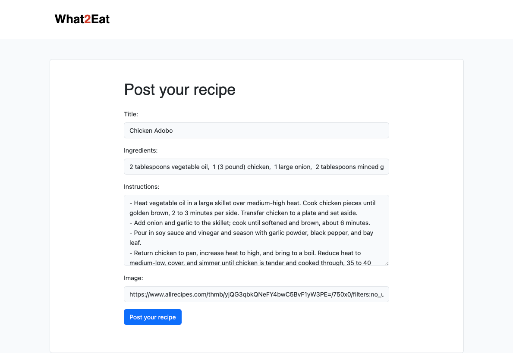
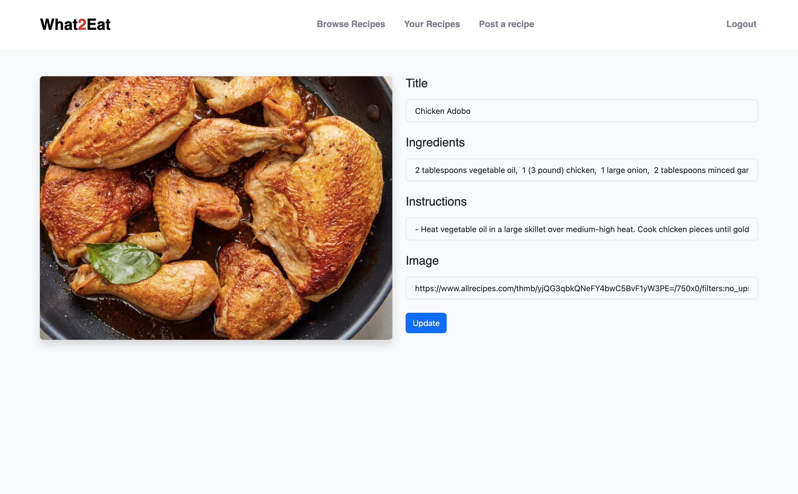

# Recipe Sharing Platform

Welcome to our Recipe Sharing Platform! This application is my warmup project using laravel for Kredo. Basically this app allows users to share their favorite recipes with the community. Whether you're a professional chef or a home cook, this platform is designed for everyone who loves cooking and sharing their culinary creations.

## Features

### 1. **Browse Recipes**
- Users can explore a variety of recipes posted by other members on the index page without the need to log in.
- Clicking on a recipe will display a modal with detailed information, including the title, ingredients, and instructions.

### 2. **User Authentication**
- Users can register and log in to access additional features.
- We've utilized Laravel's authentication scaffold and enhanced the UI for a seamless user experience.

### 3. **Manage Your Recipes**
- Once logged in, users can navigate to `/recipes` to view all their posted recipes.
- Each recipe is presented in a card UI format. Clicking on a card will open a modal with options to edit or delete the recipe.

### 4. **Adding Recipes**
- Authenticated users have the feature to post their own recipe within the site. Navigate to `/recipes/create` to view the form where the users need to fill out.
- The form is very much straightforward, though one thing the users need to know is that when they want to delimit the ingredients to be in bullet form, they need to add commas (`,`) in between the recipes. 
- The users also need to add dashes (`-`) between instructions for it to be delimited as an ordered list.

Ex: 
Title: Adobo
Ingredients: Soy sauce, Garlic, Vinegar, Bay leaf
Instructions:
 `- Lorem`
 `- Ipsum`
 `- Dolor`

 

### 4. **Delete Recipes**
- Users have the option to remove any of their recipes. Once deleted, the recipe is permanently removed from the database.

### 5. **Edit Recipes**
- If users wish to make changes to their recipes, they can do so by clicking the edit option in the modal.
- This will redirect them to the editing page at `recipes/{id}`.
- After making the desired changes, submitting the form will update the recipe details via the `recipes/edit/{id}` API endpoint.

## Getting Started 
### Prerequisites

1. **PHP**: Ensure you have PHP installed. Laravel requires PHP >= 7.3.
2. **Composer**: This is a tool for dependency management in PHP.

